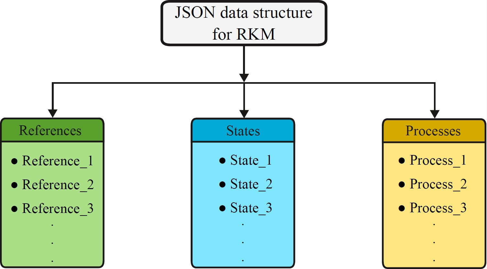

.. MATLAB Sphinx Documentation Test documentation master file, created by
   sphinx-quickstart on Wed Jan 15 11:38:03 2014.
   You can adapt this file completely to your liking, but it should at least
   contain the root `toctree` directive.

Welcome to MCPlas toolbox!
=====================================

.. image:: images/Logo_version_2.jpg
   :scale: 25%
   :align: center
  

Introduction
-------------

.. include:: manual_rst_introduction/introduction.rst
   
   
Structure
-----------------
The code directory has the following structure:

..  code-block:: none
        
    MCPlas
    ├── applications
    │  
    ├── docs
    │   
    ├── plasma
    │ 
    ├── schemas
    │   
    ├── toolbox
    │ 
    └── MCPlas.m	

.. toctree::
   :maxdepth: 2

application
************
The Application folder in the MCPlas toolbox serves as the central location for organizing geometry-specific modeling cases.
It contains subfolders such as Generic1D, Generic1p5D, Generic2D, and Generic2p5D, each corresponding to a particular modelling geometry. 
Within each subfolder, there are dedicated MATLAB scripts responsible for defining the geometry, generating the mesh, and configuring project-specific properties such as solvers and study steps. 
Each case also includes a General JSON input file that provides essential settings tailored to that specific geometry (options ``1D``, ``1p5D``, ``2D``, ``2p5D``).
The General JSON input file should be prepared using Adamant web-tool.
How to prepare this input file will be explaned in some of the next sections. 
After the model-building process is completed, the resulting .mph file is automatically saved in the same subfolder, keeping all related files organized and localized. 

Generic1D
^^^^^^^^^^

The Generic1D subfolder is dedicated to application of one-dimensional, time-dependent plasma modeling. 
It contains MATLAB scripts that define the geometry, mesh, and project settings specific to 1D simulations. 
This modeling case is designed to support plasma source configurations featuring either rectangular or circular electrodes (figure 1), making it suitable for simplified yet physically relevant geometries. 
The correct specification of electrode dimensions is crucial and must be provided accurately in the associated General JSON input file.

   Figure 1, 1D modelling geometry.   

.. toctree::
   :maxdepth: 3
   
   manual_rst_application/Generic1D/SetGeometry.rst
   manual_rst_application/Generic1D/SetMesh.rst
   manual_rst_application/Generic1D/SetProject.rst
   manual_rst_application/Generic1D/Generic1D.rst
   
Generic1p5D
^^^^^^^^^^^^

The Generic1p5D subfolder is dedicated to application of one-dimensional, time-dependent plasma modeling in polar coordinates. 
It contains MATLAB scripts that configure the geometry, meshing, and project settings only for coaxial plasma source configurations (figure 2). 
This requires that electrode dimensions—such as radius of inner and outer electrodes—be accurately defined in the corresponding General JSON input file. 
These inputs determine the plasma domain and boundary conditions essential for correct simulation behavior.

   Figure 2, 1p5D modelling geometry for simulations in polar coordiantes. 

.. toctree::
   :maxdepth: 3
   
   manual_rst_application/Generic1p5D/SetGeometry.rst
   manual_rst_application/Generic1p5D/SetMesh.rst
   manual_rst_application/Generic1p5D/SetProject.rst
   manual_rst_application/Generic1p5D/Generic1p5D.rst   

Generic2D
^^^^^^^^^^

The Generic2D subfolder is dedicated to application of two-dimensional, time-dependent plasma modeling in Cartesian coordinates. 
It contains MATLAB scripts responsible for setting up the geometry, mesh, and project configuration for rectangular electrodes (see figure). 
The dimensions and positions of the rectangular electrodes must be properly specified in the associated General JSON input file.

   Figure 3, 2D modelling geometry for simulations in Cartesian coordinates.  

.. toctree::
   :maxdepth: 3
   
   manual_rst_application/Generic2D/SetGeometry.rst
   manual_rst_application/Generic2D/SetMesh.rst
   manual_rst_application/Generic2D/SetProject.rst
   manual_rst_application/Generic2D/Generic2D.rst
   
Generic2p5D
^^^^^^^^^^^^

The Generic2p5D subfolder is dedicated to the application of two-dimensional, time-dependent plasma modeling in cylindrical coordinates.
It contains MATLAB scripts responsible for setting up the geometry, mesh, and project configuration for plasma sources with rectangular or circular electrode shapes.
The dimensions and positions of both rectangular and circular electrodes must be properly specified in the associated General JSON input file, as they directly affect domain generation and boundary condition assignment.  

   Figure 4, 2D modelling geometry for simulations in cylindrical coordinates.
.. toctree::
   :maxdepth: 3
   
   manual_rst_application/Generic2p5D/SetGeometry.rst
   manual_rst_application/Generic2p5D/SetMesh.rst
   manual_rst_application/Generic2p5D/SetProject.rst
   manual_rst_application/Generic2p5D/Generic2p5D.rst

docs
****
This folder contains all the necessary files for the MCPlas Toolbox documentation.
  
plasma
*******

.. include:: manual_rst_plasma/plasma_introduction.rst

   Figure 5, A schematic representing the top-level structure of an LXCat JSON document for LTP input data.
   
   Here are two JSON input data files for argon 4-species and 23-species RKM: 

.. toctree::
   :maxdepth: 3
   
   manual_rst_plasma/Ar_Becker_2009.rst
   manual_rst_plasma/Ar_Stankov_2022.rst
   
schemas
*******
This folder contains the JSON schema used to define general input data via the Adamant web tool. 
Further details can be found in the *Preparation of general input data* section.

.. toctree::
   :maxdepth: 3
   
   manual_rst_schemas/General_JSON_schema.rst

toolbox
********
The Toolbox folder in the MCPlas toolbox contains a collection of MATLAB functions essential for building a COMSOL model using the MATLAB LiveLink module.  
These functions automate model generation by systematically calling COMSOL-specific commands to define all essential features of the model.
By organizing model-building tasks into modular scripts, the folder ensures clarity, maintainability, and flexibility of the model building process.
  
.. toctree::
   :maxdepth: 3
   
   manual_rst_toolbox/ReadJSON.rst
   manual_rst_toolbox/InpRKM.rst
   manual_rst_toolbox/InpGeneral.rst
   manual_rst_toolbox/SetParameters.rst
   manual_rst_toolbox/SetConstants.rst
   manual_rst_toolbox/SetVariables.rst
   manual_rst_toolbox/SetTransportCoefficients.rst
   manual_rst_toolbox/SetRateCoefficients.rst
   manual_rst_toolbox/SetEnergyRateCoefficients.rst
   manual_rst_toolbox/SetRates.rst
   manual_rst_toolbox/SetEnergyRates.rst
   manual_rst_toolbox/SetFluxes.rst
   manual_rst_toolbox/SetSources.rst
   manual_rst_toolbox/SetProbesAndGraphs.rst
   manual_rst_toolbox/AddSurfaceChargeAccumulation.rst
   manual_rst_toolbox/AddPoissonEquation.rst
   manual_rst_toolbox/AddFluidEquations.rst
   manual_rst_toolbox/SetElectrical
   manual_rst_toolbox/SetSelection.rst
   manual_rst_toolbox/msg.rst
   manual_rst_toolbox/num2strcell.rst
   manual_rst_toolbox/IsModelMember.rst
   manual_rst_toolbox/ActivatePlasma.rst

MCPlas.m
*********
This script serves as the core file of the MCPlas toolbox. 
It begins by loading user-defined chemistry and general model settings from JSON files, parsing them into structured input objects. 
After initializing the COMSOL environment and defining the working path, it systematically calls MATLAB functions to establish parameters, geometry, physical constants, variables, transport and reaction coefficients, and model equations. 
It configures electrical conditions, surface effects, and postprocessing elements like probes and plots. 
Meshing and solver settings are finalized before the complete model is saved as a .mph file. 

.. function:: MCPlas.MCPlas

Preparation of general input data
---------------------------------

In addition to input data containing information on the RKM and species transport properties, some general input data are required to build the model. 
For the preparation of these data in JSON data format employing of the Adamant web-tool (https://plasma-mds.github.io/adamant/) is proposed. 
This tool is primarily intended to facilitate the implementation of digital research data management processes in small laboratories by enabling easy compilation and creation of metadata and metadata schemas based on JSON schema standards. 
All the features of the Adamant are very convenient for generating the JSON data format containing all general input data necessary for model generation. 

In general, Adamant can generate JSON data files based on the included JSON schema. 
The JSON schema can be included in three ways: (i) selecting one of the existing schemas, (ii) uploading a schema already prepared by the user, or (iii) creating a schema from scratch directly on the platform. 
The MCPlas toolbox comes with a pre-prepared JSON schema. 
Based on Plasma-MDS~(*S. Franke, L. Paulet, J. Sch¨afer, D. O’Connell, M. M. Becker, Sci. Data (2020) 439*), a metadata schema for plasma science, the provided JSON schema is designed to promote the application of the FAIR data principles to plasma modelling. 
For the purposes of MCPlas, Plasma-MDS was specifically modified to correspond to the general input data required to set up the fluid-Poisson model in COMSOL.

The user has to upload the provided JSON schema to the Adamant platform and start the rendering process. 
Subsequently, Adamant automatically generates an interactive web form schema, whose elements correspond to the general input data that the user has to complete.
The elements are structured into three major object fields: plasma source, plasma medium, and diagnostics. 
The plasma source field describes the geometry, electrical, and material properties of the source. 
The plasma medium field encompasses the general characteristics of the gas under study, as well as the surface properties specific to the included species and surface materials. 
Finally, the diagnostics field contains the relevant properties of the fluid–Poisson model, which is employed here as a diagnostic tool for investigation.
Compiling the fully defined web form schema generates a JSON data file containing all general input data needed for the model building. 
If the user wants to make a modelling analysis with changed general input data, it just needs to start the rendering process of the JSON schema again, edit the desired data in the web form schema, and generate a new JSON data file.
  
How to use it
-------------
  
.. include:: manual_rst_tutorial/MCPlas_workflow.rst
.. figure:: images/MCPlas_workflow.png
   :width: 75%
   :align: center 

   Figure 6, MCPlas worklow.
 
.. include:: manual_rst_tutorial/Step_by_step_tutorial.rst 

.. video:: video/my_video.mp4
    :width: 640
    :height: 360
    :autoplay:
   

 
Indices and tables
==================

* :ref:`genindex`
* :ref:`search`
